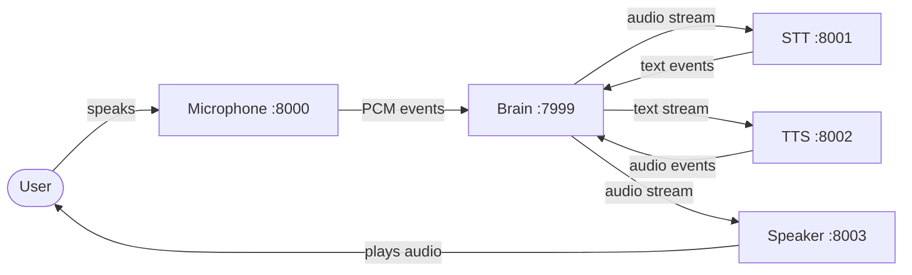
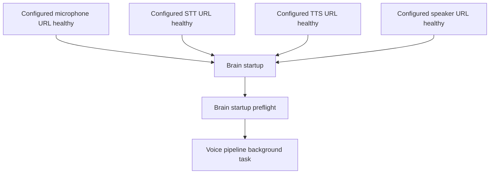
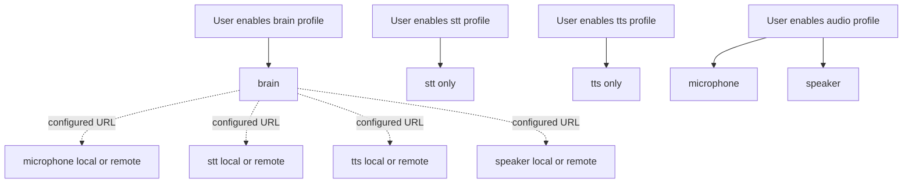

# FULL_OBLIVION Dependency Graph

## Full Voice Pipeline

## Startup Dependencies

## Service Selection Expansion

## Runtime Dependency Matrix

| Service | Startup Dependencies | Runtime Dependencies |
|---|---|---|
| brain | configured service URLs | HTTP access to microphone, stt, tts, and speaker, local or remote |
| microphone | none | PortAudio, host input device |
| stt | none | OpenAI API or faster-whisper model cache |
| tts | none | OpenAI API or pyttsx3/espeak |
| speaker | none | PortAudio, host output device |

## Conflict Points

| Resource | Services | Mitigation |
|---|---|---|
| Host ports `7999-8003` | all | Change `.env` host port mappings |
| Container port `8000` | microphone | Fixed by service source; do not add another internal `8000` service with the same name/port expectation |
| Audio input device | microphone | Run one microphone instance per physical input |
| Audio output device | speaker | Run one speaker instance per physical output |
| STT model cache | stt | Use named volume `stt-model-cache` |
