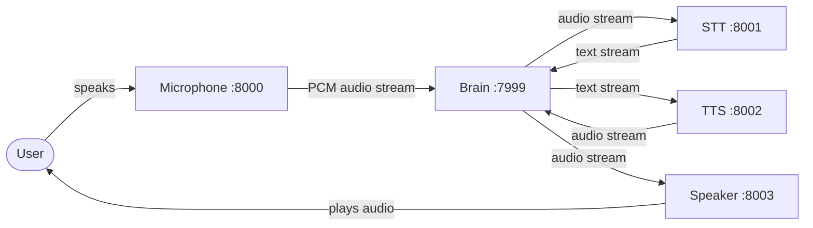
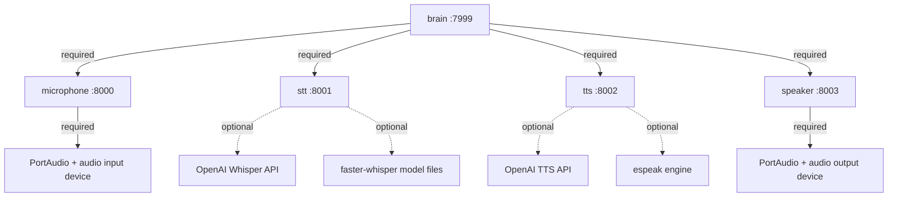

# DEPLOYMENT.md — FULL_OBLIVION Docker Compose Deployment System

## Project Identity

- **Project name:** FULL_OBLIVION
- **Short description:** Multi-microservice voice AI agent platform. Captures audio from a local microphone, transcribes speech to text, synthesizes text to speech, and plays audio through a local speaker — coordinated by a central brain orchestrator over HTTP.
- **Main role within the ecosystem:** Self-contained real-time voice pipeline composed of five independent Python FastAPI/Uvicorn microservices communicating over HTTP.

---

## Ecosystem Overview



All inter-service communication uses HTTP streaming (NDJSON/SSE) on a shared Docker bridge network. The brain orchestrator is the only service that initiates connections to other services.

---

## Repository Sources

Source code does not exist locally. Every service must be obtained from its Git repository.

```yaml
repositories:
  brain_microservice:
    git: https://github.com/DanielCalvo-Calvicia/brain_microservice.git
    branch: main

  microphone_microservice:
    git: https://github.com/DanielCalvo-Calvicia/microphone_microservice.git
    branch: main

  stt_microservice:
    git: https://github.com/DanielCalvo-Calvicia/stt_microservice.git
    branch: main

  tts_microservice:
    git: https://github.com/DanielCalvo-Calvicia/tts_microservice.git
    branch: main

  speaker_microservice:
    git: https://github.com/DanielCalvo-Calvicia/speaker_microservice.git
    branch: main
```

Repositories are cloned into a `repos/` directory inside the deployment root. All build contexts reference this directory.

---

## Service Inventory

| Service | Compose Name | Port | Language | Framework | Hardware | Profiles |
|---|---|---|---|---|---|---|
| Brain | `brain` | 7999 | Python | FastAPI/Uvicorn | None | `brain`, `full` |
| Microphone | `microphone` | 8000 | Python | FastAPI/Uvicorn | Audio input | `microphone`, `full`, `audio` |
| STT | `stt` | 8001 | Python | FastAPI/Uvicorn | None | `stt`, `full`, `transcription` |
| TTS | `tts` | 8002 | Python | FastAPI/Uvicorn | None | `tts`, `full`, `synthesis` |
| Speaker | `speaker` | 8003 | Python | FastAPI/Uvicorn | Audio output | `speaker`, `full`, `audio` |

---

## Execution Strategy

### Per-Service Startup

Every service follows the same entry point pattern:

```
main.py → asyncio.run(setup()) → composition root builds dependencies → Uvicorn serves FastAPI app
```

| Service | Startup Command | Working Directory | Bind Address Source | Port Source |
|---|---|---|---|---|
| Brain | `python main.py` | repo root | `SERVICE_HOST` env var (default `127.0.0.1`) | `SERVICE_PORT` env var (default `7999`) |
| Microphone | `python main.py` | repo root | **Hardcoded** `127.0.0.1` in `setup.py` | **Hardcoded** `8000` in `setup.py` |
| STT | `python main.py` | repo root | `SERVICE_HOST` env var (default `127.0.0.1`) | `SERVICE_PORT` env var (default `8001`) |
| TTS | `python main.py` | repo root | `SERVICE_HOST` env var (default `127.0.0.1`) | `SERVICE_PORT` env var (default `8002`) |
| Speaker | `python main.py` | repo root | `SERVICE_HOST` env var (default `127.0.0.1`) | `SERVICE_PORT` env var (default `8003`) |

### Critical Build-Time Patch

The microphone service hardcodes `host="127.0.0.1"` and `port=8000` in `composition_root/setup/setup.py`. In Docker, this causes the service to listen only on the container's loopback interface, making it **unreachable from other containers**.

The Dockerfile for the microphone service **must** patch this at build time:

```dockerfile
RUN sed -i 's/host="127.0.0.1", port=8000/host="0.0.0.0", port=8000/' composition_root/setup/setup.py
```

All other services read bind address from `SERVICE_HOST` env var and should be configured with `SERVICE_HOST=0.0.0.0` in Docker.

### Required Startup Sequence

**Strict ordering is required.**

1. **Phase 1** (parallel): microphone, stt, tts, speaker — no inter-service dependencies.
2. **Phase 2** (wait): All Phase 1 services must pass health checks.
3. **Phase 3**: brain — depends on all four Phase 1 services.

The brain runs a **startup preflight** that polls health endpoints on all four services in a loop (default 2-second interval, configurable 60–120 second timeout). If any service is unreachable within the timeout, the brain aborts.

In Docker Compose, this ordering is enforced via `depends_on` with `condition: service_healthy`.

---

## Runtime Lifecycle

### Initialization

| Service | Init Steps |
|---|---|
| All | Load `.env` → build dependency container → register FastAPI routes → start Uvicorn |
| Brain (additional) | Preflight: poll all 4 services via HTTP health checks → launch voice pipeline as background `asyncio.Task` |

### Normal Operation

- All five services run as long-lived HTTP servers.
- Brain maintains persistent HTTP streaming connections to all four services.
- Each service supports **one active stream at a time**. Concurrent requests cancel or replace existing streams.
- STT and speaker support optional autoload workers (disabled by default) that auto-connect to external stream URLs.

### Shutdown

- All services handle `SIGINT` / `SIGTERM` gracefully.
- Uvicorn stops accepting new connections and drains existing ones.
- **Brain cleanup:** Cancel background pipeline task → `POST /stop` to microphone → close all HTTP client connections.
- **Microphone cleanup:** Stop active audio stream if running.
- **Others:** Uvicorn shutdown is sufficient.

### Recovery Behavior

- No built-in automatic reconnection or pipeline restart.
- If a peripheral service dies, brain's pipeline fails and logs the error. Brain does **not** auto-recover.
- Full recovery requires restarting the brain (which re-runs preflight and re-establishes streams).
- No persistent state to recover. All streams are ephemeral.

---

## Service Dependencies

### Dependency Matrix



### Inter-Service Dependencies

| Dependency | Required By | Required Before Startup | Can Reconnect | Optional |
|---|---|---|---|---|
| Microphone HTTP (:8000) | Brain | Yes (preflight) | No | No |
| STT HTTP (:8001) | Brain | Yes (preflight) | No | No |
| TTS HTTP (:8002) | Brain | Yes (preflight) | No | No |
| Speaker HTTP (:8003) | Brain | Yes (preflight) | No | No |

### External API Dependencies

| Dependency | Required By | When Used | Required Before Startup | Can Reconnect |
|---|---|---|---|---|
| OpenAI Whisper API (`api.openai.com`) | STT | `STT_ENGINE=openai` | No | Yes |
| OpenAI TTS API (`api.openai.com/v1/audio/speech`) | TTS | `TTS_ADAPTER=openai` | No | Yes |

### System Dependencies

| Dependency | Required By | Notes |
|---|---|---|
| PortAudio (`libportaudio2`, `portaudio19-dev`) | Microphone, Speaker | System library for audio I/O |
| `libsndfile1` | Microphone, Speaker | Audio file format support for soundfile |
| Audio input device | Microphone | Physical microphone accessible via PortAudio |
| Audio output device | Speaker | Physical speaker accessible via PortAudio |
| `espeak`, `libespeak1` | TTS (pyttsx3 mode) | Linux speech synthesis engine |
| `libgomp1` | STT (local mode) | OpenMP runtime for CTranslate2/faster-whisper |
| Python 3.12 | All | Runtime (3.12 chosen for ML dependency compatibility) |
| Temp file write access | STT, TTS | Temporary WAV files per utterance |
| HuggingFace model cache | STT (local mode) | `faster-whisper` model download on first run |

---

## Automatic Dependency Resolution

When a user selects services to deploy, the system must automatically include transitive dependencies.

### Resolution Rules

| User Selects | Actually Deployed | Reason |
|---|---|---|
| `brain` | brain, microphone, stt, tts, speaker | Brain depends on all four |
| `stt` | stt | No service dependencies |
| `tts` | tts | No service dependencies |
| `microphone, speaker` | microphone, speaker | No cross-dependencies |
| `brain, stt` | brain, microphone, stt, tts, speaker | Brain pulls in all four regardless |
| `stt, tts, speaker` | stt, tts, speaker | Independent services |

### Implementation

Docker Compose handles this automatically. When brain has `depends_on: [microphone, stt, tts, speaker]` and a user activates the `brain` profile, Compose starts all dependencies even if their profiles aren't explicitly activated.

---

## Resource Usage

### Network Ports

| Port | Service | Configurable | Protocol |
|---|---|---|---|
| 7999 | Brain | Yes (`SERVICE_PORT` env) | HTTP/TCP |
| 8000 | Microphone | **No** (hardcoded in source) | HTTP/TCP |
| 8001 | STT | Yes (`SERVICE_PORT` env) | HTTP/TCP |
| 8002 | TTS | Yes (`SERVICE_PORT` env) | HTTP/TCP |
| 8003 | Speaker | Yes (`SERVICE_PORT` env) | HTTP/TCP |

Docker Compose maps the original service ports directly. If host-side port remapping is needed, change the `ports` entries in `docker-compose.yml`.

### Filesystem / Volumes

| Volume | Service | Purpose | Docker Volume |
|---|---|---|---|
| HuggingFace cache | STT (local) | Persist model downloads | Named volume `stt-model-cache` → `/root/.cache/huggingface` |
| Temp directory | STT, TTS | Temp WAV files | Container default `/tmp` (no mount needed) |

### Hardware Devices

| Device | Service | Linux Path | Access Type |
|---|---|---|---|
| Audio input (microphone) | Microphone | `/dev/snd` | Shared via device mapping |
| Audio output (speaker) | Speaker | `/dev/snd` | Shared via device mapping |
| PulseAudio socket | Microphone, Speaker | `/run/user/$UID/pulse` | Volume mount |

---

## Conflict Analysis

### Port Conflicts

| Resource | Conflict Scenario | Mitigation |
|---|---|---|
| Host port 7999 | Another service on host uses this port | Change the Brain `ports` mapping in `docker-compose.yml` |
| Host port 8000 | Common default for many dev servers | Change the Microphone `ports` mapping in `docker-compose.yml` |
| Host port 8001 | Another service on host uses this port | Change the STT `ports` mapping in `docker-compose.yml` |
| Host port 8002 | Another service on host uses this port | Change the TTS `ports` mapping in `docker-compose.yml` |
| Host port 8003 | Another service on host uses this port | Change the Speaker `ports` mapping in `docker-compose.yml` |

**Internal container ports are fixed** (especially microphone at 8000 which is hardcoded). Conflicts are managed by changing host-side port mappings only.

### Hardware Device Conflicts

| Resource | Conflict Scenario | Mitigation |
|---|---|---|
| `/dev/snd` | Another container or host process uses the audio device | Only run one microphone/speaker instance. Use `SPEAKER_DEVICE_INDEX` / `SPEAKER_DEVICE_KEYWORDS` to select specific devices. |
| PulseAudio socket | Multiple processes competing for audio control | Ensure PulseAudio is configured for shared access |

### Cross-Project Conflicts

| Resource | Conflict Scenario | Mitigation |
|---|---|---|
| Ports 7999–8003 | Related projects at `D:\Hobbys\IA\Full_Ai_Agent\` use the same ports | Stop conflicting projects or change host port mappings in `docker-compose.yml` |
| Audio devices | Other projects capturing the same microphone/speaker | Run only one audio-consuming project at a time |

### Unresolvable Conflicts

- Microphone container port 8000 cannot be changed without source modification. If another container within the Compose stack needs port 8000 internally, the microphone service must be modified.
- Audio hardware is inherently exclusive. Two services cannot capture the same microphone device simultaneously.

---

## Concurrency Rules

**Classification: Single Instance Only**

- Each service supports one active stream at a time.
- Microphone and speaker require exclusive hardware access.
- Microphone port is hardcoded — two instances fail to bind.
- Brain assumes exactly one instance of each service at the configured URLs.
- No load balancer, service discovery, or multi-instance coordination exists.

---

## Startup Ordering

### Compose depends_on Chain

```yaml
brain:
  depends_on:
    microphone:
      condition: service_healthy
    stt:
      condition: service_healthy
    tts:
      condition: service_healthy
    speaker:
      condition: service_healthy
```

### Startup Phases

| Phase | Services | Mode | Condition to Advance |
|---|---|---|---|
| 1 | microphone, stt, tts, speaker | Parallel | All pass health checks |
| 2 | brain | Sequential | Preflight confirms all dependencies |

### Shutdown Order

| Priority | Services | Reason |
|---|---|---|
| 1 (first) | brain | Triggers cleanup: stop microphone, close connections |
| 2 (after brain) | microphone, stt, tts, speaker | Safe to stop after brain releases them |

---

## Health Monitoring

### Health Endpoints Per Service

| Service | Primary Endpoint | Method | Healthy Response | Fallback |
|---|---|---|---|---|
| Brain | `/health` | GET | HTTP 200 | — |
| Brain (deep) | `/integrations/health` | GET | 200 + `data.all_available: true` | — |
| Microphone | `/health` | GET | HTTP 200 | — |
| STT | `/available` | GET | 200 + `data.is_available: true` | `/health` → 200 |
| TTS | `/available` | GET | 200 + `data.is_available: true` | `/health` → 200 |
| Speaker | `/health` | GET | HTTP 200 | — |

### Docker Health Check Configuration

| Service | Check Command | Interval | Timeout | Retries | Start Period |
|---|---|---|---|---|---|
| microphone | `python -c "urllib.request.urlopen('http://localhost:8000/health')"` | 10s | 5s | 3 | 15s |
| stt | `python -c "urllib.request.urlopen('http://localhost:8001/health')"` | 10s | 5s | 3 | 30s |
| tts | `python -c "urllib.request.urlopen('http://localhost:8002/health')"` | 10s | 5s | 3 | 20s |
| speaker | `python -c "urllib.request.urlopen('http://localhost:8003/health')"` | 10s | 5s | 3 | 15s |
| brain | `python -c "urllib.request.urlopen('http://localhost:7999/health')"` | 15s | 5s | 5 | 90s |

Health checks use Python's built-in `urllib` to avoid installing `curl` in slim images.

Brain has a longer start period (90s) because its preflight must wait for all four dependencies first.

STT has a longer start period (30s) because `faster-whisper` model loading (local mode) can be slow.

### System-Level Health

Brain's `GET /integrations/health` is the single endpoint that validates the entire pipeline is wired correctly. It checks all four downstream services and returns an aggregate status.

---

## Failure Recovery

### Safe Restart Procedure

1. `docker compose --profile <active_profile> down` (stops brain first due to dependency ordering).
2. `docker compose --profile <active_profile> up -d` (restarts in dependency order).

### Dependency Recovery

If a single peripheral service crashes:

1. Docker's `restart: unless-stopped` policy restarts it automatically.
2. Brain's active pipeline will fail during the outage.
3. Brain must be restarted after the peripheral is healthy again (brain does not auto-reconnect).
4. Simplest recovery: `docker compose restart brain`.

### Crash Recovery Requirements

- No persistent state. All stream data is ephemeral.
- Orphaned temp WAV files in STT/TTS containers are cleaned up on container restart.
- `faster-whisper` model cache (named volume) survives container restarts.

---

## Build Strategy

### Dockerfile Requirements Per Service

No Dockerfiles exist in any repository. All must be generated.

| Service | Base Image | System Packages | Python Requirements File | Build-Time Patches |
|---|---|---|---|---|
| Brain | `python:3.12-slim-bookworm` | `curl` | `requirements.linux.txt` (exists) | None |
| Microphone | `python:3.12-slim-bookworm` | `curl`, `libportaudio2`, `portaudio19-dev`, `libsndfile1` | `requirements.windows.txt` (no linux file exists) | `sed` patch to replace hardcoded `host="127.0.0.1"` with `host="0.0.0.0"` in `composition_root/setup/setup.py` |
| STT | `python:3.12-slim-bookworm` | `curl`, `libgomp1` | `requirements.windows.txt` (no linux file exists) | None |
| TTS | `python:3.12-slim-bookworm` | `curl`, `espeak`, `espeak-data`, `libespeak1` | `requirements.linux.txt` (exists) | None |
| Speaker | `python:3.12-slim-bookworm` | `curl`, `libportaudio2`, `portaudio19-dev`, `libsndfile1` | `requirements.linux.txt` (exists) | None |

### Dockerfile Template Pattern

Every Dockerfile follows the same structure:

```
1. FROM python:3.12-slim-bookworm
2. WORKDIR /app
3. Install system packages via apt-get
4. COPY requirements*.txt and pip install (prefer linux, fall back to windows)
5. COPY application source (excluded by .dockerignore: windows/, .vscode/, tests/, docs/, __pycache__/, .env*)
6. Apply build-time patches if needed
7. Set ENV defaults (SERVICE_HOST=0.0.0.0, SERVICE_PORT=<port>)
8. EXPOSE <port>
9. CMD ["python", "main.py"]
```

### Requirements File Handling

Not all services have `requirements.linux.txt`:

| Service | `requirements.linux.txt` | `requirements.windows.txt` | Dockerfile Strategy |
|---|---|---|---|
| Brain | Exists | Exists | Use linux |
| Microphone | **Missing** | Exists | Use windows (packages are platform-independent pip names) |
| STT | **Missing** | Exists | Use windows (packages are platform-independent pip names) |
| TTS | Exists | Exists | Use linux |
| Speaker | Exists | Exists | Use linux |

The Dockerfile should use this fallback pattern:

```dockerfile
COPY requirements*.txt ./
RUN if [ -f requirements.linux.txt ]; then \
        pip install --no-cache-dir -r requirements.linux.txt; \
    else \
        pip install --no-cache-dir -r requirements.windows.txt; \
    fi
```

### .dockerignore Contents

A `.dockerignore` file must be placed in each repo's root during bootstrap to keep build contexts small:

```
windows/
linux/
venv/
.venv/
.vscode/
.pytest_cache/
__pycache__/
*.pyc
.env
.env.*
.git/
.gitignore
tests/
docs/
*.md
```

---

## Docker Compose Architecture

### Profile System

Services are grouped into profiles for selective deployment:

| Profile | Services Included | Use Case |
|---|---|---|
| `full` | All 5 services | Full pipeline deployment |
| `brain` | brain (+ auto-resolves microphone, stt, tts, speaker via depends_on) | Brain orchestrator (implies full) |
| `microphone` | microphone only | Standalone audio capture |
| `stt` | stt only | Standalone transcription |
| `tts` | tts only | Standalone synthesis |
| `speaker` | speaker only | Standalone playback |
| `audio` | microphone, speaker | Audio I/O pair |
| `transcription` | stt | Alias for stt |
| `synthesis` | tts | Alias for tts |

### Usage Examples

```bash
# Full pipeline
docker compose --profile full up -d

# Brain (auto-includes all dependencies)
docker compose --profile brain up -d

# Just STT and TTS (no hardware)
docker compose --profile stt --profile tts up -d

# Audio services only
docker compose --profile audio up -d
```

### Compose Service Definitions

Each service in `docker-compose.yml` must include:

```yaml
services:
  <name>:
    build:
      context: ./repos/<repo_name>
    container_name: oblivion-<name>
    ports:
      - "${<NAME>_PORT:-<default>}:<container_port>"
    environment:
      # Service-specific env vars
    profiles:
      - <service_name>
      - full
      # Optional additional profiles
    healthcheck:
      test: [CMD, python, -c, "import urllib.request; urllib.request.urlopen('http://localhost:<port>/health')"]
      interval: 10s
      timeout: 5s
      retries: 3
      start_period: <varies>
    restart: unless-stopped
    networks:
      - oblivion
```

### Brain-Specific Configuration

Brain must override all base URL env vars to point to Docker service names instead of `127.0.0.1`:

```yaml
brain:
  environment:
    MICROPHONE_BASE_URL: http://microphone:8000
    STT_BASE_URL: http://stt:8001
    TTS_BASE_URL: http://tts:8002
    SPEAKER_BASE_URL: http://speaker:8003
    STARTUP_PREFLIGHT_ENABLED: "true"
    STARTUP_PREFLIGHT_TIMEOUT_SECONDS: "120"
    MICROSERVICE_READY_POLL_INTERVAL_SECONDS: "3"
  depends_on:
    microphone:
      condition: service_healthy
    stt:
      condition: service_healthy
    tts:
      condition: service_healthy
    speaker:
      condition: service_healthy
```

### Network

A single bridge network named `oblivion` connects all services. Services reference each other by Compose service name (e.g., `http://stt:8001`).

### Volumes

```yaml
volumes:
  stt-model-cache:
    # Persists faster-whisper model downloads across container restarts
```

### Audio Device Passthrough (Optional)

Microphone and speaker containers need audio hardware access. This must be opt-in since not all deployments have audio hardware:

```yaml
# Uncomment for Linux with ALSA
devices:
  - /dev/snd:/dev/snd

# Uncomment for Linux with PulseAudio
volumes:
  - /run/user/${HOST_UID:-1000}/pulse:/run/user/1000/pulse
  - ${PULSE_COOKIE:-/dev/null}:/root/.config/pulse/cookie
environment:
  PULSE_SERVER: unix:/run/user/1000/pulse/native
```

These should be commented out by default in the generated `docker-compose.yml` with clear instructions.

---

## Environment Configuration

### .env.example Contents

```ini
# ============================================================
# FULL_OBLIVION — Docker Compose Environment
# ============================================================
# Edit root .env. Docker Compose maps these values to each service's
# original container env var names.
# ============================================================

# STT values mapped into stt as OPENAI_API_KEY, STT_ENGINE, STT_LANGUAGE
# Required for STT_ENGINE=openai and TTS_ADAPTER=openai
STT_OPENAI_API_KEY=
STT_ENGINE=openai
STT_LANGUAGE=en

# TTS values mapped into tts as OPENAI_API_KEY and TTS_* / OPENAI_* vars
TTS_OPENAI_API_KEY=
TTS_ADAPTER=openai
TTS_OPENAI_TTS_MODEL=gpt-4o-mini-tts
TTS_OPENAI_TTS_VOICE=alloy
TTS_OPENAI_TTS_RESPONSE_FORMAT=wav
# pyttsx3 only:
TTS_SPEECH_RATE=140
TTS_VOICE_NAME=

# --- Speaker ---
SPEAKER_DEVICE_INDEX=
SPEAKER_DEVICE_KEYWORDS=i2s,hw,default,sysdefault

# --- Brain ---
BRAIN_STARTUP_PREFLIGHT_TIMEOUT_SECONDS=60
MICROSERVICE_READY_POLL_INTERVAL_SECONDS=3

# --- Audio Hardware (Linux) ---
# HOST_UID=1000
# PULSE_COOKIE=/home/user/.config/pulse/cookie
```

---

## Scripts Specification

### Bootstrap Script

**Purpose:** Clone repositories, prepare build environment, create `.env`, build images.

**Filename:** `scripts/repo/bootstrap.sh` (Bash) + `scripts/repo/bootstrap.ps1` (PowerShell)

**Behavior:**

1. Define service registry as associative array:
   ```
   brain_microservice  → https://github.com/DanielCalvo-Calvicia/brain_microservice.git
   microphone_microservice → https://github.com/DanielCalvo-Calvicia/microphone_microservice.git
   stt_microservice    → https://github.com/DanielCalvo-Calvicia/stt_microservice.git
   tts_microservice    → https://github.com/DanielCalvo-Calvicia/tts_microservice.git
   speaker_microservice → https://github.com/DanielCalvo-Calvicia/speaker_microservice.git
   ```
2. Create `repos/` directory if missing.
3. For each service:
   - `git clone` if repo directory does not exist; skip and log if it does.
   - Copy the corresponding Dockerfile from `dockerfiles/<service>.Dockerfile` → `repos/<service>/Dockerfile`.
   - Copy `.dockerignore` → `repos/<service>/.dockerignore`.
4. If `.env` does not exist, copy `.env.example` → `.env` and warn the user to review it.
5. Run `docker compose --profile full build`.
6. Report success/failure per service.

**Error handling:** Continue on individual clone failures. Report all failures at the end. Exit non-zero if any critical step fails.

**Future services:** Adding a service requires only adding an entry to the registry array and providing a Dockerfile. No structural changes to the script.

### Update Script

**Purpose:** Pull latest code from all cloned repos, re-copy Dockerfiles, optionally rebuild.

**Filename:** `scripts/repo/update.sh` + `scripts/repo/update.ps1`

**Behavior:**

1. For each repo in `repos/`:
   - Remove `Dockerfile` and `.dockerignore` (prevent git pull conflicts).
   - `git pull --ff-only` (fail-safe: no merge commits).
   - Re-copy Dockerfile and `.dockerignore` from `dockerfiles/`.
2. Optionally accept `--rebuild` flag to trigger `docker compose --profile full build` after pulling.
3. Report which repos had changes (check git pull output for "Already up to date").

### Rebuild Script

**Purpose:** Rebuild Docker images for specific or all services, recreate containers.

**Filename:** `scripts/repo/rebuild.sh` + `scripts/repo/rebuild.ps1`

**Behavior:**

1. Accept optional service names as arguments (e.g., `./rebuild.sh stt tts`).
2. If no arguments, rebuild all services.
3. Run `docker compose build --no-cache <services>`.
4. Run `docker compose --profile <active_profile> up -d <services>` to recreate.

---

## Service Selection Guide

### Decision Tree

```
Do you need the full voice pipeline (mic → STT → TTS → speaker)?
├── Yes → use profile: full
│         All 5 services, audio hardware required
│
├── No, but I need the brain orchestrator
│   └── profile: brain
│       Auto-includes all 4 dependencies
│       Audio hardware required
│
├── No, I just need transcription
│   └── profile: stt
│       Standalone STT service
│       Requires OPENAI_API_KEY (openai mode) or CPU/RAM (local mode)
│       No hardware required
│
├── No, I just need speech synthesis
│   └── profile: tts
│       Standalone TTS service
│       Requires OPENAI_API_KEY (openai mode) or espeak (pyttsx3 mode)
│       No hardware required
│
├── No, I just need audio capture
│   └── profile: microphone
│       Standalone microphone capture
│       Audio input hardware required
│
└── No, I just need audio playback
    └── profile: speaker
        Standalone speaker playback
        Audio output hardware required
```

### Hardware vs Software-Only Deployments

| Deployment Type | Profiles | Hardware Needed | Notes |
|---|---|---|---|
| Full pipeline | `full` | Microphone + Speaker | Complete voice loop |
| Software only | `stt`, `tts` | None | API-based processing, no audio I/O |
| Audio capture only | `microphone` | Microphone | Raw audio stream producer |
| Audio playback only | `speaker` | Speaker | Raw audio stream consumer |
| Cloud deployment | `stt`, `tts`, `brain` | None* | *Brain requires all 4 deps — microphone and speaker start but cannot play/capture without hardware. Brain preflight will pass (health endpoints respond) but the pipeline will fail at audio I/O. |

---

## Containerization Notes

### Base Image Selection

`python:3.12-slim-bookworm` is chosen because:

- Python 3.12 has verified compatibility with `faster-whisper`, `ctranslate2`, `onnxruntime`.
- Python 3.14 (used in development `__pycache__` tags) has unverified ML dependency compatibility.
- `slim-bookworm` provides a minimal Debian base with standard system library support.

### Per-Service Container Requirements

| Service | Devices | Privileged | Host Networking | Special Volumes |
|---|---|---|---|---|
| Brain | None | No | No | None |
| Microphone | `/dev/snd` (ALSA) | No* | No | PulseAudio socket |
| STT | None | No | No | `stt-model-cache` (named volume) |
| TTS | None | No | No | None |
| Speaker | `/dev/snd` (ALSA) | No* | No | PulseAudio socket |

*May require `--privileged` or `SYS_RAWIO` capability on some Linux configurations for direct ALSA access.

### Audio in Docker: Platform Matrix

| Host OS | Audio System | Container Access Method | Complexity |
|---|---|---|---|
| Linux (ALSA) | ALSA | `devices: [/dev/snd:/dev/snd]` | Low |
| Linux (PulseAudio) | PulseAudio | Mount socket + cookie | Medium |
| Linux (PipeWire) | PipeWire (PulseAudio compat) | Mount PipeWire socket as PulseAudio | Medium |
| Windows (Docker Desktop) | WSL2 | **Not supported** — no audio passthrough to containers | N/A |
| macOS (Docker Desktop) | CoreAudio | **Not supported** — no audio passthrough to containers | N/A |

**On Windows and macOS:** Microphone and speaker services should run natively on the host. Only brain, STT, and TTS should be containerized.

---

## Orchestration Recommendations

### Restart Policy

| Service | Policy | Reason |
|---|---|---|
| All | `unless-stopped` | Survives Docker daemon restarts; only stops when explicitly stopped |

### Start Priority

| Priority | Services | Reason |
|---|---|---|
| 1 (first) | microphone, stt, tts, speaker | No dependencies; may have slow init (model loading, hardware probing) |
| 2 (last) | brain | Depends on all four; preflight validates readiness |

### Shutdown Priority

| Priority | Services | Reason |
|---|---|---|
| 1 (first) | brain | Gracefully disconnects from all services |
| 2 (after brain) | microphone, stt, tts, speaker | Safe to stop after brain releases connections |

Docker Compose `down` handles this automatically via `depends_on` reverse ordering.

### Scaling Limitations

- **Cannot scale horizontally.** Each service is single-instance by design.
- **replicas > 1 must not be used** for any service.
- Hardware-bound services (microphone, speaker) cannot scale beyond one instance per physical device.

### Resource Recommendations

| Service | CPU | Memory | Notes |
|---|---|---|---|
| Brain | 0.5 | 256 MB | Lightweight HTTP orchestrator |
| Microphone | 0.25 | 128 MB | Audio capture is low-overhead |
| STT (openai) | 0.25 | 128 MB | Proxies to OpenAI API |
| STT (local) | 2.0+ | 2 GB+ | `faster-whisper` CPU inference |
| TTS (openai) | 0.25 | 128 MB | Proxies to OpenAI API |
| TTS (pyttsx3) | 0.5 | 256 MB | Local speech synthesis |
| Speaker | 0.25 | 128 MB | Audio playback is low-overhead |

---

## Deployment Guide

### Prerequisites

- Docker Engine 24+ with Docker Compose v2
- Git
- Internet access (to clone repos and pull Docker images)
- Audio hardware (for microphone/speaker services)
- OpenAI API key (if using OpenAI-backed STT/TTS)

### Quick Start

```bash
# 1. Clone the deployment repo (or create the deployment directory)
cd /path/to/deployment

# 2. Run bootstrap
./scripts/repo/bootstrap.sh

# 3. Edit .env — at minimum set OPENAI_API_KEY if using OpenAI
nano .env

# 4. Start the full pipeline
docker compose --profile full up -d

# 5. Verify health
curl http://localhost:7999/integrations/health
```

### Stopping

```bash
docker compose --profile full down
```

### Viewing Logs

```bash
# All services
docker compose --profile full logs -f

# Specific service
docker compose logs -f brain
```

### Updating

```bash
./scripts/repo/update.sh --rebuild
docker compose --profile full up -d
```

---

## Execution Metadata

```yaml
project_name: FULL_OBLIVION
services:
  brain:
    startup_command: "python main.py"
    working_directory: "/app"
    container_port: 7999
    startup_dependencies: [microphone, stt, tts, speaker]
    runtime_dependencies: [microphone_http, stt_http, tts_http, speaker_http]
    health_check: "GET http://localhost:7999/health -> 200"
    deep_health_check: "GET http://localhost:7999/integrations/health -> 200 + all_available=true"
    restart_policy: unless-stopped
    supports_multiple_instances: false
    startup_priority: 2
    shutdown_priority: 1
    profiles: [brain, full]
    devices: []
    volumes: []
    exclusive_resources:
      - "TCP port 7999"
    container_requirements:
      base_image: "python:3.12-slim-bookworm"
      system_packages: [curl]
      build_patches: []
      env_overrides:
        SERVICE_HOST: "0.0.0.0"
        MICROPHONE_BASE_URL: "http://microphone:8000"
        STT_BASE_URL: "http://stt:8001"
        TTS_BASE_URL: "http://tts:8002"
        SPEAKER_BASE_URL: "http://speaker:8003"

  microphone:
    startup_command: "python main.py"
    working_directory: "/app"
    container_port: 8000
    startup_dependencies: []
    runtime_dependencies: [portaudio, audio_input_device]
    health_check: "GET http://localhost:8000/health -> 200"
    restart_policy: unless-stopped
    supports_multiple_instances: false
    startup_priority: 1
    shutdown_priority: 2
    profiles: [microphone, full, audio]
    devices: ["/dev/snd"]
    volumes: ["pulseaudio_socket"]
    exclusive_resources:
      - "TCP port 8000 (hardcoded)"
      - "Audio input device"
    container_requirements:
      base_image: "python:3.12-slim-bookworm"
      system_packages: [curl, libportaudio2, portaudio19-dev, libsndfile1]
      build_patches:
        - description: "Replace hardcoded bind address"
          command: "sed -i 's/host=\"127.0.0.1\", port=8000/host=\"0.0.0.0\", port=8000/' composition_root/setup/setup.py"
      env_overrides: {}

  stt:
    startup_command: "python main.py"
    working_directory: "/app"
    container_port: 8001
    startup_dependencies: []
    runtime_dependencies: [openai_api_or_faster_whisper]
    health_check: "GET http://localhost:8001/health -> 200"
    restart_policy: unless-stopped
    supports_multiple_instances: false
    startup_priority: 1
    shutdown_priority: 2
    profiles: [stt, full, transcription]
    devices: []
    volumes: ["stt-model-cache:/root/.cache/huggingface"]
    exclusive_resources:
      - "TCP port 8001"
    container_requirements:
      base_image: "python:3.12-slim-bookworm"
      system_packages: [curl, libgomp1]
      build_patches: []
      env_overrides:
        SERVICE_HOST: "0.0.0.0"

  tts:
    startup_command: "python main.py"
    working_directory: "/app"
    container_port: 8002
    startup_dependencies: []
    runtime_dependencies: [openai_api_or_pyttsx3_engine]
    health_check: "GET http://localhost:8002/health -> 200"
    restart_policy: unless-stopped
    supports_multiple_instances: false
    startup_priority: 1
    shutdown_priority: 2
    profiles: [tts, full, synthesis]
    devices: []
    volumes: []
    exclusive_resources:
      - "TCP port 8002"
    container_requirements:
      base_image: "python:3.12-slim-bookworm"
      system_packages: [curl, espeak, espeak-data, libespeak1]
      build_patches: []
      env_overrides:
        SERVICE_HOST: "0.0.0.0"

  speaker:
    startup_command: "python main.py"
    working_directory: "/app"
    container_port: 8003
    startup_dependencies: []
    runtime_dependencies: [portaudio, audio_output_device]
    health_check: "GET http://localhost:8003/health -> 200"
    restart_policy: unless-stopped
    supports_multiple_instances: false
    startup_priority: 1
    shutdown_priority: 2
    profiles: [speaker, full, audio]
    devices: ["/dev/snd"]
    volumes: ["pulseaudio_socket"]
    exclusive_resources:
      - "TCP port 8003"
      - "Audio output device"
    container_requirements:
      base_image: "python:3.12-slim-bookworm"
      system_packages: [curl, libportaudio2, portaudio19-dev, libsndfile1]
      build_patches: []
      env_overrides:
        SERVICE_HOST: "0.0.0.0"

compose:
  network: oblivion (bridge)
  named_volumes:
    - stt-model-cache
```

---

## Future Expansion

### Adding a New Service

To add a new microservice to the deployment:

1. **Add repository entry** to `services.yml` with git URL, port, profiles, dependencies.
2. **Create a Dockerfile** in `dockerfiles/<service>.Dockerfile` following the template pattern.
3. **Add a service block** to `docker-compose.yml` with profiles, environment, health check.
4. **Add the repo entry** to the bootstrap script's service registry array.
5. **Add env vars** to `.env.example` if the service requires configuration.
6. **Update dependency graph** if any existing service depends on the new one.

No changes to the script structure, Compose network, or orchestration logic are needed.

### Planned Expansion Points

- **LLM microservice** between STT and TTS (brain currently bridges text directly; an LLM processing step is architecturally anticipated).
- **AWS microservice** for cloud integrations (referenced in related codebases at `D:\Hobbys\IA\Full_Ai_Agent\aws_microservice`).
- **Web UI / Dashboard** for monitoring and control.

---

## Unknown Information

- **Target production platform:** Code references both Windows development and Linux/Raspberry Pi production. The exact production hardware is undefined.
- **GitHub repository visibility:** The provided Git URLs may be private. Bootstrap will fail if authentication is not configured.
- **GitHub repository branch names:** `main` is assumed. Actual default branches may differ.
- **Production `.env` files:** `.env.production` exists for microphone and TTS but not for brain, STT, or speaker.
- **Microphone hardcoded port intent:** Whether port 8000 is intentionally hardcoded or an oversight is unknown. The `sed` patch is a workaround.
- **Python 3.14 compatibility:** Development uses 3.14; Docker uses 3.12 for ML safety. Some features may behave differently.
- **`faster-whisper` model download behavior:** First-run model download size and duration are not documented. Could cause long first-start times.
- **PCM byte order:** Little-endian inferred but not declared. Cross-architecture Docker builds (e.g., ARM) may have issues.
- **CORS middleware:** `ALLOWED_ORIGINS` is configured in speaker `.env` but middleware registration is unconfirmed across services.
- **Brain pipeline auto-restart:** `STARTUP_INTERNAL_PIPELINE_RESTART_DELAY_SECONDS` env var exists but its runtime behavior is unconfirmed.
- **Audio device behavior in containers:** Exact PulseAudio/PipeWire socket paths and permissions vary by Linux distribution and configuration.
- **Container registry:** No pre-built images exist. All images must be built locally from source. A future CI/CD pipeline could push to a registry.
