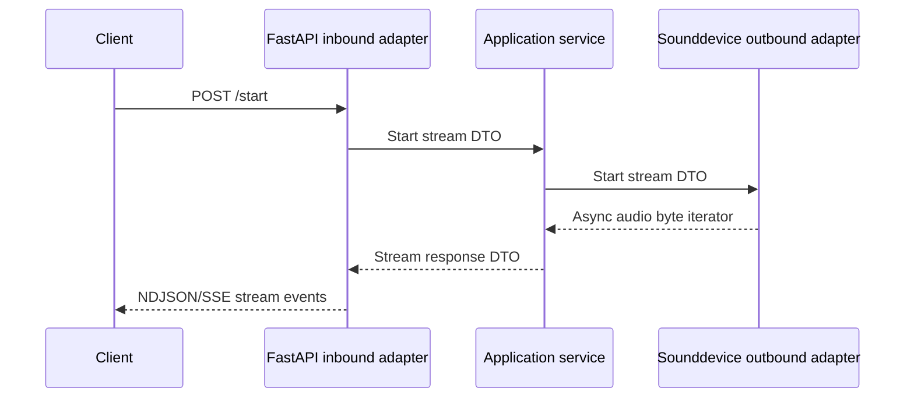

# Microphone Service vs Base Pattern Comparison

Date: 2026-06-25

Compared against: `docs/architecture/service_pattern_base_report.md`

Service path: `D:\Hobbys\IA\FULL_OBLIVION\repos\microphone_microservice`

## Executive Summary

The microphone service mostly follows the base ports-and-adapters pattern. It has a clear entry point, composition root, FastAPI inbound adapter, application service, ports, DTOs, mappers, outbound hardware adapter, documentation, and stream-contract tests.

The main deviations are that stream event construction and silence segmentation live in the HTTP inbound adapter, hardware readiness is not exposed separately from stream activity, authentication is absent, and concurrency is limited to one active stream with no explicit lock.

Overall pattern conformance: 7/10.

## Pattern Conformance Matrix

| Pattern Area | Status | Evidence | Notes |
|---|---|---|---|
| Standard folder structure | Matches | `application/`, `composition_root/`, `infrastructure/`, `tests/`, `main.py` | Strong alignment with base structure. |
| Naming conventions | Mostly matches | `MicrophoneService`, `FastApiAdapter`, `MicrophoneAdapter`, `ServicePort` | Clear role names. |
| Entry point/bootstrap | Matches | `main.py`, `composition_root/setup/setup.py` | Uses `asyncio.run(setup())` and Uvicorn setup. |
| Composition root | Matches | `composition_root/dependencies/microphone_dependency.py`, `containers/container.py` | Builds app, service, inbound adapter, outbound adapter. |
| Inbound adapter | Matches with concern | `infrastructure/inbound/http/fastapi_adapter.py` | Also owns silence segmentation and stream protocol logic. |
| Application service | Matches but thin | `application/services/service.py` | Framework-neutral and delegates to outbound port. |
| Ports/interfaces | Matches | `application/ports/*.py` | ABC-style ports. |
| DTO/mappers | Matches | `application/dtos/*.py`, mapper files | Explicit boundary DTOs. Some duplication. |
| Outbound adapter | Matches | `infrastructure/outbound/windows_sounddevice.py` | Owns `sounddevice` integration. |
| Stream/event contract | Matches | `/start` emits NDJSON/SSE events | Contract tested. |
| HTTP API contract | Mostly matches | `/start`, `/stop`, `/available`, `/health` | No deeper readiness endpoint. |
| Configuration | Partial | setup reads `SERVICE_HOST`, `SERVICE_PORT`, aliases | Hardware selection is hardcoded/defaulted in container builder. |
| Runtime/deployment | Matches | Dockerfile and root Compose exist | Dockerfile includes compatibility patching. |
| Observability | Partial | Logger calls throughout | Direct stdout telemetry in stream wrapper. |
| Error handling | Partial | HTTP 500 JSON; stream error event | Raw exception text can be exposed. |
| Reliability | Partial | Stop cleanup; single active stream check | No lock, retry policy, or durable recovery. |
| Security | Missing | No auth found in routes | High-risk if reachable beyond trusted host/LAN. |
| Testing | Good | `test_start_endpoint.py`, `test_runtime_environment.py` | Strong stream contract tests; hardware adapter not deeply tested. |
| Documentation | Good | `README.md`, `docs/general.md` | Clear route and event documentation. |

## File-Level Pattern Comparison

| File | Expected Pattern | Actual Fit | Deviation |
|---|---|---|---|
| `main.py` | Minimal process entry point | Good | None significant. |
| `composition_root/setup/setup.py` | Runtime setup and Uvicorn bootstrap | Good | Cleanup after `server.serve()` rather than FastAPI lifespan. |
| `composition_root/dependencies/microphone_dependency.py` | Dependency graph factory | Good | Builds adapter config with fixed defaults. |
| `application/services/service.py` | Framework-neutral use-case orchestration | Good | Very thin pass-through. |
| `application/ports/*.py` | Abstract layer contracts | Good | `get_app` leaks framework object through inbound port. |
| `application/dtos/*.py` | Boundary DTOs | Good | DTOs are duplicated across layers. |
| `application/dtos/mapper/*.py` | Pure mapping functions | Good | Mostly isomorphic transformations. |
| `infrastructure/inbound/http/fastapi_adapter.py` | Transport adapter | Mixed | Also performs audio silence segmentation and event generation. |
| `infrastructure/outbound/windows_sounddevice.py` | Runtime/hardware adapter | Good | Direct stdout telemetry and mutable stream state. |
| `tests/test_start_endpoint.py` | Contract tests | Good | Covers event shape, silence, SSE, errors. |

## Required Pattern Elements Present

- Clear process entry point.
- Composition root and dependency builder.
- FastAPI inbound adapter.
- Application service over an outbound port.
- Abstract ports.
- DTOs and mappers.
- Hardware outbound adapter.
- Stream event contract.
- Health endpoint.
- Contract tests.
- Service documentation.

## Optional Pattern Elements Present

- SSE compatibility.
- Runtime environment helper.
- Manual E2E script.
- Docker deployment support.

## Missing or Weak Pattern Elements

| Missing/Weak Element | Impact |
|---|---|
| Authentication/authorization | Any reachable caller can start microphone capture. |
| Hardware readiness endpoint | `/health` can pass while no usable microphone exists. |
| Central stream schema package | Event contract is locally implemented and can drift from other services. |
| Explicit concurrency lock | Parallel `/start` calls could race around adapter state. |
| Bounded stream policy | Long-running streams have no explicit max duration or request-level guard. |
| Sanitized error envelope | Raw exception strings are returned in JSON error responses. |
| Deep hardware adapter tests | Device selection and fallback behavior depend on manual/real hardware verification. |

## Control Flow Compared to Pattern

This matches the base request lifecycle. The main pattern variance is that the inbound adapter transforms raw audio chunks into domain-significant recording segments.

## Contract Comparison

| Contract | Pattern Expectation | Actual |
|---|---|---|
| Stream envelope | `type`, `sequence`, `timestamp`, `payload` | Matches. |
| Partial event | Incremental payload | Uses `bytes_base64`. |
| Completed event | Logical completion payload | Uses `reason` and `output_bytes_base64`. |
| Error event | `code`, `message`, `recoverable` | Matches. |
| Health | Liveness | Present. |
| Readiness | External dependency readiness | Not clearly present; `/available` reports active stream, not device readiness. |

## Recommendations

1. Add authentication or network-layer protection before exposing the service beyond localhost.
2. Add `/ready` or improve `/available` to test microphone device availability without requiring an active stream.
3. Move stream event schema and encoder/validator into a shared package.
4. Add an async lock around start/stop state transitions.
5. Replace raw exception exposure with sanitized error codes.
6. Add mocked `sounddevice` tests for device selection, fallback sample rate, stereo fallback, and cleanup.

## Final Assessment

The service is a strong implementation of the base pattern for a local hardware-bound microservice. It needs security, readiness, and concurrency hardening before it can be treated as production-ready.
