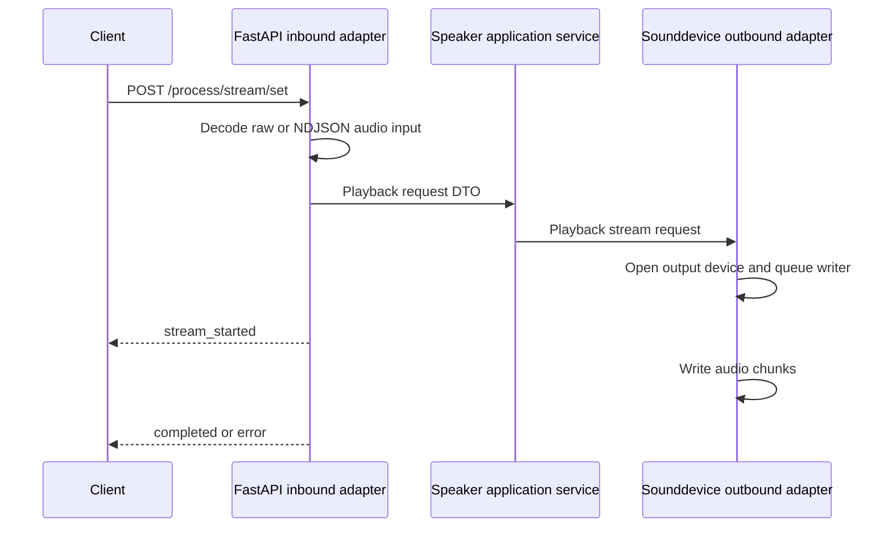

# Speaker Service vs Base Pattern Comparison

Date: 2026-06-25

Compared against: `docs/architecture/service_pattern_base_report.md`

Service path: `D:\Hobbys\IA\FULL_OBLIVION\repos\speaker_microservice`

## Executive Summary

The speaker service follows the base pattern well for a narrow hardware-bound playback service. It has a clear entry point, setup layer, composition root, FastAPI inbound adapter, application service, outbound hardware adapter, ports, DTOs, optional autoload worker, tests, and strong documentation.

Its main deviations are a deliberately smaller API surface, no readiness endpoint, missing authentication, no verified CORS middleware despite CORS-like config, and single active playback state that can replace existing playback.

Overall pattern conformance: 7/10.

## Pattern Conformance Matrix

| Pattern Area | Status | Evidence | Notes |
|---|---|---|---|
| Standard folder structure | Matches | `application/`, `composition_root/`, `infrastructure/`, `runtime/`, `tests/` | Good alignment. |
| Naming conventions | Matches | `SpeakerService`, `FastApiAdapter`, `SoundDeviceSpeakerAdapter` | Clear roles. |
| Entry point/bootstrap | Matches | `main.py`, setup module | Uses Uvicorn setup. |
| Composition root | Matches | `composition_root/dependencies/speaker_dependency.py` | Builds app, service, adapters, lifespan. |
| Inbound adapter | Matches | `infrastructure/inbound/http/fastapi_adapter.py` | Handles raw and NDJSON playback input. |
| Application service | Matches | `application/services/service.py` | Framework-neutral orchestration. |
| Ports/interfaces | Matches | `application/ports/*.py` | ABC contracts. |
| DTO/mappers | Mostly matches | DTOs and mapper files | Simpler mapper set than stream processors. |
| Outbound adapter | Matches | `infrastructure/outbound/speaker/sounddevice_adapter.py` | Hardware integration isolated. |
| Stream/event contract | Matches | NDJSON response events and NDJSON input validation | Strong input tests. |
| HTTP API contract | Partial by design | `/health`, `/process/stream/set` | No `/available` readiness endpoint. |
| Configuration | Partial | device index/keywords/autoload origins | Parsed `ALLOWED_ORIGINS` not verified as middleware. |
| Runtime/deployment | Matches | Dockerfile, root Compose, device mapping | Hardware passthrough documented. |
| Observability | Partial | Logger calls | No verified metrics/tracing. |
| Error handling | Good for streaming | Setup failure 500; stream errors | Raw failure messages can surface. |
| Reliability | Partial | Lifespan cleanup, playback replacement | No durable queue/session model. |
| Security | Missing | No auth found | Arbitrary playback risk. |
| Testing | Good | `test_stream_contract.py` | Strong route and NDJSON validation tests. |
| Documentation | Good | README | Detailed service behavior and caveats. |

## File-Level Pattern Comparison

| File | Expected Pattern | Actual Fit | Deviation |
|---|---|---|---|
| `main.py` | Process entry point | Good | None significant. |
| `composition_root/setup/setup.py` | Bootstrap and server creation | Good | `_cleanup` is placeholder; lifespan owns cleanup. |
| `composition_root/dependencies/speaker_dependency.py` | Dependency graph and lifespan | Good | Parses `ALLOWED_ORIGINS`, but middleware was not verified. |
| `application/services/service.py` | Application orchestration | Good | Thin mapping/delegation layer. |
| `application/ports/*.py` | Abstract contracts | Good | Inbound port exposes `get_app`. |
| `application/dtos/*.py` | Boundary DTOs | Good | Focused and smaller than other stream services. |
| `application/dtos/mapper/*.py` | Mapping functions | Good | Mostly simple transformations. |
| `infrastructure/inbound/http/fastapi_adapter.py` | HTTP transport adapter | Good | Includes ASGI-safe custom streaming response. |
| `infrastructure/inbound/http/audio_stream_autoloader.py` | Optional background worker | Good | Fixed reconnect behavior. |
| `infrastructure/outbound/speaker/sounddevice_adapter.py` | Hardware outbound adapter | Good | Owns queue and device stream. |
| `tests/test_stream_contract.py` | Contract tests | Very good | Covers route surface, NDJSON validation, error events. |

## Required Pattern Elements Present

- Entry point.
- Composition root.
- FastAPI inbound adapter.
- Application service.
- Ports/interfaces.
- DTOs and mappers.
- Outbound hardware adapter.
- Health endpoint.
- Stream contract tests.
- Documentation.

## Optional Pattern Elements Present

- Optional autoload worker.
- NDJSON audio input support.
- Raw byte stream input support.
- FastAPI lifespan cleanup.
- Custom streaming response to avoid request/response receive conflicts.

## Missing or Weak Pattern Elements

| Missing/Weak Element | Impact |
|---|---|
| Authentication/authorization | Any reachable caller can play arbitrary audio. |
| Readiness endpoint | `/health` does not prove output device can open. |
| Verified CORS middleware | Parsed origin config may not affect HTTP responses. |
| Shared stream schema package | Contract duplicated locally. |
| Concurrent session isolation | New playback can interrupt current playback. |
| Backoff policy | Autoloader reconnects with fixed delay. |
| Hardware adapter unit tests | Device selection and fallback behavior are not deeply verified. |

## Control Flow Compared to Pattern

The flow matches the base pattern. The key service-specific variation is that the response stream is status/control events while the request body carries the main audio payload.

## Contract Comparison

| Contract | Pattern Expectation | Actual |
|---|---|---|
| Input stream | Raw or structured stream input | Supports raw bytes and NDJSON audio events. |
| Response stream | Standard event envelope | Uses NDJSON status events. |
| Completed event | Logical completion | Uses `reason=end_of_input`. |
| Error event | Structured recoverable error | Present. |
| Health | Liveness | Present. |
| Readiness | Runtime dependency availability | Missing. |
| Availability | Optional backend check | Missing. |

## Recommendations

1. Add auth before exposing playback endpoint outside a trusted local boundary.
2. Add `/available` or `/ready` that verifies output device selection/openability safely.
3. Apply or remove `ALLOWED_ORIGINS`; do not leave parsed-but-unused config.
4. Add explicit policy for concurrent playback: reject, queue, or replace.
5. Add shared stream contract validation helpers.
6. Add mocked `sounddevice` tests for device selection, stream open failure, write failure, and cleanup.
7. Add metrics for playback sessions, bytes queued/written, hardware failures, and interrupted playback.

## Final Assessment

The service is a clean narrow implementation of the base pattern, with especially good stream input contract tests. It needs security, readiness, and concurrency-policy improvements to mature beyond a trusted local runtime.
