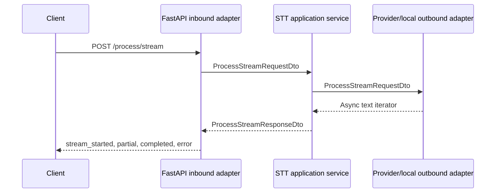

# STT Service vs Base Pattern Comparison

Date: 2026-06-25

Compared against: `docs/architecture/service_pattern_base_report.md`

Service path: `D:\Hobbys\IA\FULL_OBLIVION\repos\stt_microservice`

## Executive Summary

The STT service aligns well with the base service pattern. It has a clear FastAPI entry surface, composition root, application service, ports, DTOs, mappers, provider adapters, stream/event contracts, environment tests, stream-contract tests, and optional background autoload behavior.

The strongest pattern matches are service layering, decoupled stream flow, environment handling, and tests. The main gaps are missing authentication, single shared in-memory stream state, inconsistent depth of stream validation across paths, and limited operational reliability controls around provider calls and autoloader retries.

Overall pattern conformance: 8/10.

## Pattern Conformance Matrix

| Pattern Area | Status | Evidence | Notes |
|---|---|---|---|
| Standard folder structure | Matches | `application/`, `composition_root/`, `infrastructure/`, `runtime/`, `tests/` | Very close to base pattern. |
| Naming conventions | Matches | `STTService`, `FastApiAdapter`, `OpenAISTTAdapter`, `LocalSTTAdapter` | Adapter names expose provider choice. |
| Entry point/bootstrap | Matches | `main.py`, setup module | Loads env before project code that reads env. |
| Composition root | Matches | `composition_root/dependencies/stt_dependency.py` | Selects backend from env and creates lifespan. |
| Inbound adapter | Matches | `infrastructure/inbound/http/fastapi_adapter.py` | Registers all routes and stream responses. |
| Application service | Matches | `application/services/service.py` | Delegates through outbound port and manages shared stream. |
| Ports/interfaces | Matches | `application/ports/*.py` | ABC contracts. |
| DTO/mappers | Matches | `application/dtos/*.py`, mapper files | Explicit layer DTOs. |
| Outbound adapter | Matches | OpenAI and local adapters | Provider/runtime logic is isolated. |
| Stream/event contract | Mostly matches | `stream_events.py`, stream tests | Text output events are well tested. |
| HTTP API contract | Matches | Health, available, process stream, set/get stream, batch, stop | Rich route surface. |
| Configuration | Good | `runtime/environment.py`, env tests | Required OpenAI key is enforced for OpenAI backend. |
| Runtime/deployment | Matches | Dockerfiles, root Compose, model cache volume | Local model cache supported. |
| Observability | Partial | Logger calls throughout | No verified metrics/tracing. |
| Error handling | Partial | 500 JSON and stream error events | Provider retry/timeout policy not centralized. |
| Reliability | Partial | Stop endpoint, autoloader retry loop | Single stream state, no durable replay. |
| Security | Missing | No route auth found | Paid provider and text/audio processing are unprotected. |
| Testing | Good | Contract, env, final flush tests | Strongest of the service set. |
| Documentation | Partial | README exists | Less comprehensive than the base ideal. |

## File-Level Pattern Comparison

| File | Expected Pattern | Actual Fit | Deviation |
|---|---|---|---|
| `main.py` | Entry point and env preloading | Good | Calls environment handling before startup. |
| `runtime/environment.py` | Runtime environment resolver | Good | More advanced than minimum pattern. |
| `composition_root/setup/setup.py` | Uvicorn bootstrap | Good | Calls environment application again. |
| `composition_root/dependencies/stt_dependency.py` | Dependency factory | Good | Backend selection and required key validation. |
| `application/services/service.py` | Framework-neutral orchestration | Good | Owns in-memory decoupled stream state. |
| `infrastructure/inbound/http/fastapi_adapter.py` | HTTP adapter | Good | Large, but owns transport and protocol behavior. |
| `infrastructure/inbound/http/stream_events.py` | Stream event helper | Good | Reusable within service. |
| `infrastructure/inbound/http/voice_stream_autoloader.py` | Optional background worker | Good | Fixed retry behavior. |
| `infrastructure/outbound/openai_stt_adapter.py` | Provider adapter | Good | Isolates OpenAI integration. |
| `infrastructure/outbound/local_stt_adapter.py` | Runtime/local adapter | Good | Isolates local transcription. |
| `tests/test_stream_contract.py` | Contract tests | Very good | Covers set/get, error, NDJSON/SSE flows. |
| `tests/test_environment.py` | Config tests | Good | Verifies env precedence. |

## Required Pattern Elements Present

- Entry point and setup.
- Composition root.
- Inbound FastAPI adapter.
- Application service.
- Abstract inbound/service/outbound ports.
- DTO and mapper layer.
- Multiple outbound adapters.
- Streaming and batch APIs.
- Environment loader and tests.
- Contract tests.

## Optional Pattern Elements Present

- Decoupled stream `set`/`get` pattern.
- Optional autoloader worker.
- Local and external-provider backend selection.
- Model cache deployment volume.
- Stop endpoint.

## Missing or Weak Pattern Elements

| Missing/Weak Element | Impact |
|---|---|
| Authentication/authorization | Any caller can trigger provider use or CPU-heavy transcription. |
| Shared stream contract package | Event behavior can drift from other services. |
| Central retry/timeout policy | Provider and stream failures are handled locally rather than governed. |
| Durable queue/replay | In-flight audio/transcription is lost on crash or disconnect. |
| Multi-tenant stream isolation | Shared stream state limits concurrent pipelines. |
| Sensitive logging policy | Transcribed text may appear in logs depending on path. |
| Metrics/tracing | Operational visibility is limited to logs. |

## Control Flow Compared to Pattern

The flow matches the base pattern. The service also implements the optional decoupled flow:

## Contract Comparison

| Contract | Pattern Expectation | Actual |
|---|---|---|
| Stream output envelope | `type`, `sequence`, `timestamp`, `payload` | Matches. |
| Text partial | Incremental result | Uses `payload.text`. |
| Text completed | Logical completion | Uses `reason` and `output`. |
| Audio input | Raw or encoded stream data | Supports raw audio and NDJSON audio events. |
| Batch | Non-stream action | Present. |
| Stop | Idempotent cancellation/cleanup when applicable | Present. |
| Readiness | Backend availability | `/available` exists. |

## Recommendations

1. Add auth/rate limits before exposing any endpoint outside a trusted boundary.
2. Centralize stream event schema and validation.
3. Add explicit timeout and retry configuration for provider calls.
4. Add stream/session IDs if concurrent pipelines are needed.
5. Redact or suppress sensitive transcription content in production logs.
6. Add readiness tests that exercise configured backend availability.
7. Add metrics for audio bytes, transcription latency, provider failures, and stream completions.

## Final Assessment

The service is one of the strongest matches to the base pattern. It is architecturally coherent and well tested at the stream-contract level, but needs security, operational controls, and concurrency/session isolation for production maturity.
