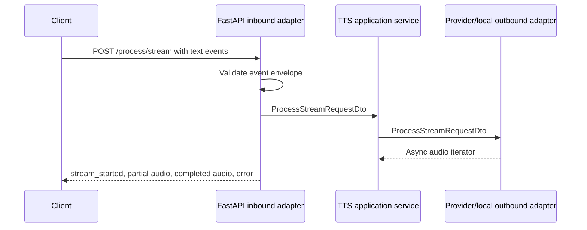

# TTS Service vs Base Pattern Comparison

Date: 2026-06-25

Compared against: `docs/architecture/service_pattern_base_report.md`

Service path: `D:\Hobbys\IA\FULL_OBLIVION\repos\tts_microservice`

## Executive Summary

The TTS service strongly follows the base pattern and is the best documented example of the generalized architecture. It includes entry point, setup, composition root, FastAPI inbound adapter, application service, ports, DTOs, mappers, provider adapters, stream event contracts, batch and decoupled stream flows, Docker support, and extensive documentation.

The main deviations are concentrated in operational and security maturity: no authentication, no rate limiting, no durable stream state, a large inbound adapter that combines several responsibilities, and provider configuration handled by environment variables without a stronger typed settings layer.

Overall pattern conformance: 8/10.

## Pattern Conformance Matrix

| Pattern Area | Status | Evidence | Notes |
|---|---|---|---|
| Standard folder structure | Matches | `application/`, `composition_root/`, `infrastructure/`, `tests/`, docs | Strong alignment. |
| Naming conventions | Matches | `TTSService`, `FastApiAdapter`, `OpenAITTSAdapter`, `PyTTSx3Adapter` | Provider adapters are clear. |
| Entry point/bootstrap | Matches | `main.py`, setup module | Environment and logging are configured before serving. |
| Composition root | Matches | `composition_root/dependencies/tts_dependency.py` | Selects outbound adapter from env. |
| Inbound adapter | Matches with size concern | `infrastructure/inbound/http/fastapi_adapter.py` | Owns route registration, validation, stream encoding. |
| Application service | Matches | `application/services/service.py` | Framework-neutral and port-driven. |
| Ports/interfaces | Matches | `application/ports/*.py` | ABC contracts. |
| DTO/mappers | Matches | DTO and mapper files | Explicit, but duplicated. |
| Outbound adapter | Matches | OpenAI and local adapters | External/local synthesis isolated. |
| Stream/event contract | Strong | Stream validation and tests | One of the clearest implementations. |
| HTTP API contract | Strong | Health, available, stream, set/get, batch | Rich route surface. |
| Configuration | Partial | `infrastructure/config.py`, env reads | Not strongly typed; invalid numeric env can fail startup. |
| Runtime/deployment | Matches | Dockerfiles, root Compose | Installs local TTS runtime dependencies. |
| Observability | Partial | Logger calls | No verified metrics/tracing. |
| Error handling | Good for streams | Error events and HTTP failures | Some raw exception exposure remains. |
| Reliability | Partial | Lifespan init, stream error events | Single shared stream and no provider circuit breaker. |
| Security | Missing | No route auth found | Paid provider usage is unprotected. |
| Testing | Good | `test_stream_contract.py`, `test_decoupled_stream.py` | Strong protocol tests; live test depends on running service. |
| Documentation | Strong | README, streaming docs, structure docs | Best match to documentation pattern. |

## File-Level Pattern Comparison

| File | Expected Pattern | Actual Fit | Deviation |
|---|---|---|---|
| `main.py` | Entry point | Good | None significant. |
| `infrastructure/config.py` | Runtime config resolver | Good | Could become typed settings model. |
| `composition_root/setup/setup.py` | Bootstrap/Uvicorn | Good | Uses env-loaded host/port. |
| `composition_root/dependencies/tts_dependency.py` | Dependency graph and backend selection | Good | Parses several env vars inline. |
| `application/services/service.py` | Framework-neutral orchestration | Good | Thin delegation through ports. |
| `application/ports/*.py` | Abstract contracts | Good | Covers stream, set/get, batch, availability. |
| `application/dtos/*.py` | Layer DTOs | Good | Duplicated shapes across layers. |
| `application/dtos/mapper/*.py` | Mapping functions | Good | Mostly isomorphic. |
| `infrastructure/inbound/http/fastapi_adapter.py` | HTTP/stream adapter | Good but large | Combines validation, queue setup, event encoding, routes. |
| `infrastructure/outbound/tts/openai_tts_adapter.py` | External provider adapter | Good | Validates key/format and calls provider. |
| `infrastructure/outbound/tts/pyttsx3_adapter.py` | Local runtime adapter | Good | Uses temp WAV generation and queue markers. |
| `tests/test_stream_contract.py` | Contract tests | Very good | Covers malformed input and event behavior. |
| `README_STREAMING.md` | Contract/flow docs | Very good | Strong reusable reference. |

## Required Pattern Elements Present

- Entry point and setup.
- Composition root.
- FastAPI inbound adapter.
- Application service.
- Abstract ports.
- DTOs and mappers.
- Multiple outbound adapters.
- Stream and batch contracts.
- Provider configuration.
- Contract tests.
- Documentation.

## Optional Pattern Elements Present

- Decoupled `set`/`get` stream flow.
- Multiple provider/runtime backends.
- Detailed architecture documentation.
- Local temporary file processing.
- OpenAI-compatible base URL configuration.

## Missing or Weak Pattern Elements

| Missing/Weak Element | Impact |
|---|---|
| Authentication/authorization | Any caller can trigger local synthesis or paid provider calls. |
| Rate limiting/quotas | Provider spend and resource usage are unbounded. |
| Shared contract package | Stream schema is implemented locally. |
| Typed settings model | Env parsing failures become startup exceptions without structured config report. |
| Durable stream/session model | Single shared stream prevents safe concurrent pipelines. |
| Metrics/tracing | Latency, provider failures, and stream throughput are not measured centrally. |
| Smaller protocol modules | Large inbound adapter is harder to maintain. |

## Control Flow Compared to Pattern

The service matches the base pattern closely. Its decoupled flow also matches the optional shared-stream pattern:

## Contract Comparison

| Contract | Pattern Expectation | Actual |
|---|---|---|
| Text input stream | Standard stream envelope | Strong validation. |
| Audio output stream | Standard stream envelope | Uses base64 audio payloads and logical segment markers. |
| Batch endpoint | Optional batch action | Present. |
| Provider availability | Readiness-style endpoint | `/available` exists. |
| Error stream event | Structured error payload | Present. |
| Heartbeat | Optional long stream keepalive | Present in stream behavior. |

## Recommendations

1. Add auth and rate limits before exposing provider-backed endpoints.
2. Extract stream event schema, validation, and encoding into a shared package.
3. Split the large inbound adapter into route registration, validation, and stream encoding modules.
4. Replace inline env parsing with a typed settings object.
5. Add session IDs if multiple simultaneous synthesis streams are required.
6. Add provider timeout, retry, and circuit-breaker policy.
7. Add metrics for text length, audio bytes, latency, provider errors, and queue lifecycle.

## Final Assessment

The service is a strong concrete implementation of the base architecture and a good source for future service templates. Its main next step is production hardening: security, rate limiting, typed config, and shared contract governance.
